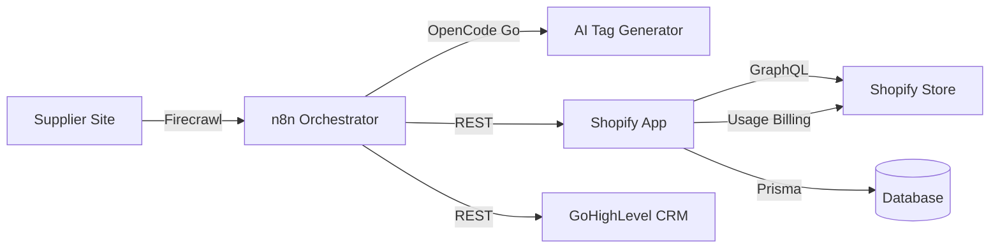

# SmartTag AI

> **AI-powered SEO tag generation for Shopify stores.**  
> Scans products, generates optimized tags via AI, queues for merchant approval, charges $0.10 per approved product.


## Architecture



**Core loop:** Scrape → Parse → Queue → Approve → Charge → Sync

## Quick Start

```bash
git clone https://github.com/YOUR_USER/smart-tag-ai
cd smart-tag-ai
npm install
npx prisma generate
npm run dev
```

## Tech Stack

| Layer | Technology |
|-------|-----------|
| Frontend | React Router v7 + TypeScript + Polaris |
| Backend | Node.js 22+, Prisma ORM |
| Database | SQLite (dev) / PostgreSQL (prod) |
| AI | OpenCode Go API (`qwen3.7-plus`) |
| Orchestration | n8n (self-hosted VPS) |
| Scraping | Firecrawl API |
| CRM | GoHighLevel REST API |
| Agent | Hermes Agent + OpenCode CLI |

## Revenue Model

- **$0.10 per product** optimized
- First 10 products **free** per merchant
- Shopify Usage Billing API handles invoicing

## Key Features

- **AI Tag Generation** — OpenCode Go API generates 5 SEO-optimized tags from product title + description
- **Approval Queue** — Merchants review AI tags before applying; approve or reject
- **Usage Billing** — Auto-charges $0.10 via Shopify on approval
- **Supplier Sync** — n8n workflow scrapes supplier sites → parses → pushes to Shopify
- **CRM Sync** — GoHighLevel contacts updated with synced product data
- **Metrics Dashboard** — Real-time revenue, acceptance rate, tag quality scores

## Project Structure

```
smart-tag-ai/
├── app/
│   ├── routes/
│   │   ├── api.webhooks.tsx        # Shopify PRODUCTS_CREATE handler
│   │   ├── api.ingest-product.tsx  # n8n ingestion endpoint
│   │   ├── app._index.tsx          # Approval panel
│   │   ├── app.metrics.tsx         # Business metrics dashboard
│   │   └── app.tsx                 # App shell with nav
│   ├── db.server.ts                # Prisma client
│   └── shopify.server.ts           # Shopify auth config
├── prisma/
│   └── schema.prisma               # PendingTag + Session models
├── n8n/
│   ├── smart-tag-ai-workflow.json  # Importable workflow
│   └── README.md                   # n8n setup guide
└── smart-tag-ai-docs/              # Obsidian vault
```

## Links

- [n8n Workflow (live)](https://n8n.monching-desierto.space/workflow/3iVv6KUSGPCcbEbH)
- [Obsidian Docs](smart-tag-ai-docs/00%20-%20Project%20Overview.md)
- [Architecture Decisions](smart-tag-ai-docs/20%20-%20Architecture%20Decisions.md)
