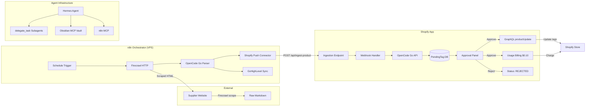

# SmartTag AI — Architecture



## Data Flow

```
Supplier → Firecrawl (Markdown) → OpenCode Go (JSON) → Shopify App (DB) 
→ Merchant Approves → GraphQL + $0.10 charge
```

## Component Details

| Component | Tech | Purpose |
|-----------|------|---------|
| Shopify App | React Router v7 + Polaris | Merchant UI for approval & billing |
| AI Engine | OpenCode Go (qwen3.7-plus) | Text-only tag generation |
| Database | Prisma + SQLite | PendingTag queue + session storage |
| Orchestrator | n8n (VPS) | Scrape → Parse → Push pipeline |
| Scraper | Firecrawl API | Web page → clean Markdown |
| CRM | GoHighLevel REST | Lead sync |
| Agent | Hermes + OpenCode | Autonomous build pipeline |
| Knowledge Base | Obsidian + MCP | Project docs & ADRs |
